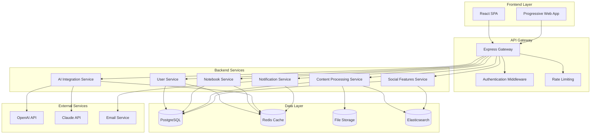

# Design Document

## Overview

The Chatbook Study Hub is a modern web application built with a microservices architecture that combines user-generated content management, AI-powered learning assistance, and social learning features. The system processes user-uploaded study materials, generates intelligent study aids, and provides an interactive tutoring experience through a clean, responsive interface.

The application follows a three-tier architecture with a React-based frontend, Node.js/Express backend services, and a combination of relational and document databases for data persistence. AI capabilities are integrated through external APIs (OpenAI/Claude) with local caching and processing pipelines.

## Architecture

### High-Level System Architecture



### Service Architecture Patterns

- **API Gateway Pattern**: Single entry point for all client requests with authentication, rate limiting, and routing
- **Microservices Pattern**: Domain-driven service separation for scalability and maintainability
- **CQRS Pattern**: Separate read/write models for complex queries and social features
- **Event-Driven Architecture**: Asynchronous processing for AI operations and notifications
- **Circuit Breaker Pattern**: Resilient external API integration with fallback mechanisms

## Components and Interfaces

### Frontend Components

#### Core Layout Components
- **AppHeader**: Navigation, search, user profile, and quick actions
- **Sidebar**: Context-sensitive navigation and metadata display
- **MainContent**: Primary content area with dynamic routing
- **NotificationCenter**: Real-time updates and progress indicators

#### Chatbook Management Components
- **ChatbookList**: Grid/list view of user's notebooks with filtering
- **ChatbookCreator**: Modal form for new notebook creation
- **ChatbookViewer**: Detailed notebook view with modules and metadata
- **ContentUploader**: Drag-and-drop file upload with progress tracking

#### Study Interface Components
- **StudyDashboard**: Two-column layout with topics and study area
- **TopicSelector**: Interactive checklist with topic management
- **AITutor**: Chat interface with conversation history
- **QuestionRenderer**: Multiple choice, understanding, and application question types
- **StudyGuideViewer**: Generated study materials with navigation

#### Social and Discovery Components
- **ExploreGrid**: Public notebook discovery with filtering
- **Leaderboard**: Rankings and contributor highlights
- **CreatorProfile**: User profiles with activity and achievements
- **SearchResults**: Unified search across notebooks, topics, and users

### Backend Service Interfaces

#### User Service API
```typescript
interface UserService {
  // Authentication
  POST /auth/register
  POST /auth/login
  POST /auth/logout
  GET /auth/profile
  
  // Profile Management
  GET /users/:id
  PUT /users/:id
  GET /users/:id/activity
  GET /users/:id/achievements
}
```

#### Notebook Service API
```typescript
interface NotebookService {
  // CRUD Operations
  GET /notebooks
  POST /notebooks
  GET /notebooks/:id
  PUT /notebooks/:id
  DELETE /notebooks/:id
  
  // Content Management
  POST /notebooks/:id/modules
  PUT /notebooks/:id/modules/:moduleId
  DELETE /notebooks/:id/modules/:moduleId
  
  // Visibility and Sharing
  PUT /notebooks/:id/visibility
  POST /notebooks/:id/follow
}
```

#### Content Processing Service API
```typescript
interface ContentProcessingService {
  // File Upload and Processing
  POST /content/upload
  GET /content/:id/status
  GET /content/:id/text
  
  // Topic Generation
  POST /content/:id/topics/generate
  PUT /content/:id/topics
  GET /content/:id/topics
}
```

#### AI Integration Service API
```typescript
interface AIService {
  // Study Material Generation
  POST /ai/study-guide
  POST /ai/questions
  POST /ai/explanations
  
  // Interactive Tutoring
  POST /ai/chat
  GET /ai/chat/:sessionId/history
  
  // Topic Analysis
  POST /ai/analyze-content
  POST /ai/suggest-topics
}
```

## Data Models

### Core Entity Models

#### User Model
```typescript
interface User {
  id: string;
  email: string;
  username: string;
  passwordHash: string;
  profile: {
    firstName: string;
    lastName: string;
    avatar?: string;
    bio?: string;
  };
  preferences: {
    studyReminders: boolean;
    emailNotifications: boolean;
    publicProfile: boolean;
  };
  metrics: {
    rank: number;
    totalStudyTime: number;
    notebooksCreated: number;
    questionsAnswered: number;
  };
  createdAt: Date;
  updatedAt: Date;
  lastActiveAt: Date;
}
```

#### Notebook Model
```typescript
interface Notebook {
  id: string;
  title: string;
  description?: string;
  ownerId: string;
  metadata: {
    schoolType: string;
    schoolName: string;
    subject: string;
    course?: string;
  };
  visibility: 'private' | 'public' | 'unlisted';
  modules: Module[];
  topics: Topic[];
  followers: string[];
  metrics: {
    views: number;
    studySessions: number;
    rating: number;
    ratingCount: number;
  };
  createdAt: Date;
  updatedAt: Date;
  lastStudiedAt?: Date;
}
```

#### Module Model
```typescript
interface Module {
  id: string;
  notebookId: string;
  title: string;
  type: 'text' | 'file' | 'link';
  content: {
    text?: string;
    fileUrl?: string;
    fileName?: string;
    fileType?: string;
    extractedText?: string;
  };
  processingStatus: 'pending' | 'processing' | 'completed' | 'failed';
  createdAt: Date;
  updatedAt: Date;
}
```

#### Topic Model
```typescript
interface Topic {
  id: string;
  notebookId: string;
  title: string;
  description: string;
  sourceModuleId: string;
  sourceText: string;
  difficulty: 'beginner' | 'intermediate' | 'advanced';
  status: 'suggested' | 'accepted' | 'rejected';
  studyMaterials: {
    studyGuideId?: string;
    questionIds: string[];
  };
  createdAt: Date;
  updatedAt: Date;
}
```

#### Study Session Model
```typescript
interface StudySession {
  id: string;
  userId: string;
  notebookId: string;
  topicIds: string[];
  type: 'multiple_choice' | 'understanding' | 'application' | 'mixed';
  questions: Question[];
  responses: Response[];
  chatHistory: ChatMessage[];
  metrics: {
    duration: number;
    correctAnswers: number;
    totalQuestions: number;
    hintsUsed: number;
  };
  startedAt: Date;
  completedAt?: Date;
}
```

### Database Schema Design

#### PostgreSQL Tables
- **users**: Core user information and authentication
- **notebooks**: Notebook metadata and ownership
- **modules**: Content modules within notebooks
- **topics**: Generated and user-defined study topics
- **study_sessions**: Learning session tracking
- **questions**: Generated practice questions
- **responses**: User answers and interactions
- **follows**: User-notebook following relationships
- **ratings**: Notebook ratings and reviews

#### Redis Cache Structure
- **user_sessions**: Authentication and session data
- **ai_responses**: Cached AI-generated content
- **topic_suggestions**: Temporary topic generation results
- **leaderboard_cache**: Pre-computed ranking data
- **search_cache**: Cached search results

#### Elasticsearch Indices
- **notebooks_index**: Full-text search across notebook content
- **topics_index**: Topic-based search and recommendations
- **users_index**: User and creator discovery

## Error Handling

### Error Classification and Response Strategy

#### Client Errors (4xx)
- **400 Bad Request**: Invalid input validation with detailed field errors
- **401 Unauthorized**: Authentication required with redirect to login
- **403 Forbidden**: Insufficient permissions with clear explanation
- **404 Not Found**: Resource not found with suggested alternatives
- **429 Too Many Requests**: Rate limiting with retry-after headers

#### Server Errors (5xx)
- **500 Internal Server Error**: Generic server error with incident ID
- **502 Bad Gateway**: External service unavailable with fallback options
- **503 Service Unavailable**: Maintenance mode with estimated recovery time

### Error Response Format
```typescript
interface ErrorResponse {
  error: {
    code: string;
    message: string;
    details?: Record<string, any>;
    timestamp: string;
    requestId: string;
  };
  fallback?: {
    action: string;
    url?: string;
    message: string;
  };
}
```

### Resilience Patterns

#### Circuit Breaker Implementation
- **AI Service Integration**: Fallback to cached responses or manual input
- **File Processing**: Queue-based retry with exponential backoff
- **Search Service**: Degraded search with database fallback

#### Graceful Degradation
- **Offline Mode**: PWA capabilities with local storage sync
- **Reduced Functionality**: Core features available during partial outages
- **Progressive Enhancement**: Basic functionality without JavaScript

## Testing Strategy

### Testing Pyramid Structure

#### Unit Tests (70%)
- **Component Testing**: React components with Jest and React Testing Library
- **Service Logic**: Business logic and data transformations
- **Utility Functions**: Helper functions and validation logic
- **API Endpoints**: Controller logic and request/response handling

#### Integration Tests (20%)
- **Database Integration**: Repository pattern with test database
- **External API Integration**: Mocked AI service responses
- **Service Communication**: Inter-service API contracts
- **File Processing Pipeline**: End-to-end content processing

#### End-to-End Tests (10%)
- **User Workflows**: Critical user journeys with Playwright
- **Cross-Browser Testing**: Chrome, Firefox, Safari compatibility
- **Mobile Responsiveness**: Touch interactions and viewport testing
- **Performance Testing**: Load testing with realistic data volumes

### Test Data Management

#### Test Database Strategy
- **Isolated Test Environment**: Separate database per test suite
- **Seed Data**: Consistent test data with factory patterns
- **Cleanup Strategy**: Automatic teardown after test completion

#### Mock Strategy
- **AI Service Mocks**: Deterministic responses for consistent testing
- **File Upload Mocks**: Simulated file processing without external dependencies
- **Email Service Mocks**: Notification testing without actual email sending

### Continuous Integration Pipeline

#### Pre-commit Hooks
- **Linting**: ESLint and Prettier for code consistency
- **Type Checking**: TypeScript compilation validation
- **Unit Tests**: Fast feedback on code changes

#### CI/CD Pipeline
- **Build Validation**: Multi-environment build testing
- **Test Execution**: Parallel test execution with coverage reporting
- **Security Scanning**: Dependency vulnerability checks
- **Performance Monitoring**: Bundle size and runtime performance tracking

### Quality Metrics and Monitoring

#### Code Quality Metrics
- **Test Coverage**: Minimum 80% line coverage requirement
- **Code Complexity**: Cyclomatic complexity monitoring
- **Technical Debt**: SonarQube integration for debt tracking

#### Performance Monitoring
- **Application Performance**: Real User Monitoring (RUM) with Core Web Vitals
- **API Performance**: Response time and error rate monitoring
- **Database Performance**: Query performance and connection pool monitoring
- **AI Service Performance**: Response time and token usage tracking